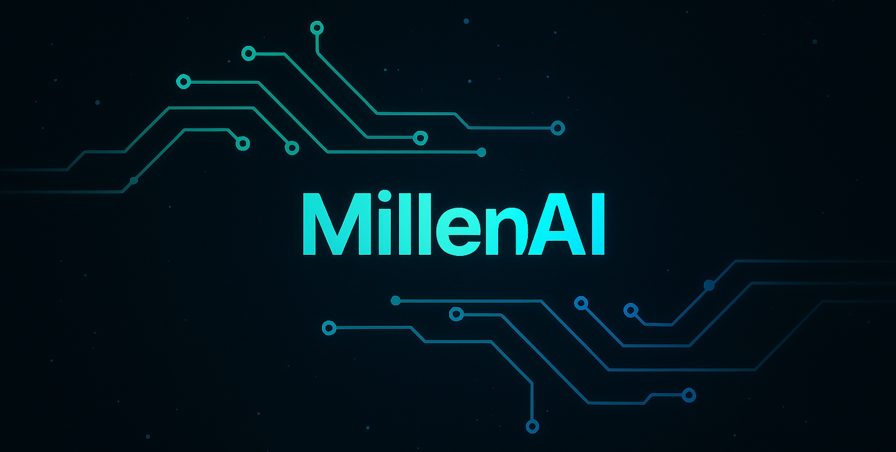
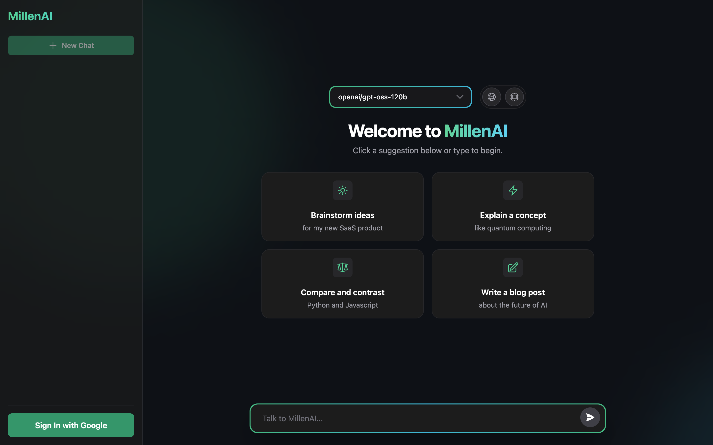

---

<h1>MillenAI</h1>

<em>"A thousand minds, one conversation"</em>

  <a href="#features">Features</a> •
  <a href="#roadmap">Roadmap</a>

  

  
  
  
  

---

**MillenAI** is a sleek, high-performance, open-source chat interface designed for seamless interaction with multiple Large Language Models. Built with modern web technologies, it prioritizes speed, user experience, and intelligent conversation management.

---

## The Problem

The landscape of Large Language Models is rapidly expanding, but interacting with them remains fragmented and frustrating:

- **Fragmented Experiences** — Each model provider has its own interface, forcing users to juggle multiple tabs and learn different UIs
- **Lost Conversations** — Most playgrounds are stateless, meaning valuable chat history and insights vanish when tabs close  
- **Hidden Advanced Features** — Powerful capabilities like web search and deep reasoning require complex API integration
- **Poor User Experience** — Functional but unpolished interfaces that lack speed and intuitive design

## The Solution

### MillenAI

<table>
<tr>
<td width="50%">

#### ⚡ **Blazing Performance**
Powered by Groq API and built with React + Vite for instantaneous interactions and fluid animations.

#### 🧠 **Unified Intelligence** 
Switch between cutting-edge models like Llama 3.1, Llama 3.3, and GPT-OSS within the same conversation thread.

#### 🔒 **Persistent & Private**
Secure Google Authentication with Firebase ensures your conversations are saved, synced, and always accessible.

</td>
<td width="50%">

#### 🛠️ **Advanced Capabilities**
Toggle web search and deep reasoning modes with a single click — no complex API calls required.

#### 📊 **Intelligent Context Management**
Real-time token visualization helps you manage long conversations and avoid unexpected truncation.

#### ✨ **Polished Experience**
Every interaction is carefully crafted with subtle animations and modern design principles.

</td>
</tr>
</table>

---

## Features

---

### Core Capabilities

- **Multi-Model Support** — Seamless switching between Llama 3.1, Llama 3.3, and GPT-OSS models
- **Universal Web Search** — Enable real-time internet access for any model with a simple toggle
- **Deep Reasoning Mode** — Advanced problem-solving capabilities for complex, multi-step analysis
- **Secure Authentication** — Google Sign-In with Firebase for safe conversation management
- **Real-Time Chat History** — Save, search, rename, and organize all your conversations
- **Collapsible Reasoning** — Clean final answers with expandable detailed thought processes
- **Live Token Counter** — Visual progress bar for context window usage monitoring
- **Rich Markdown Support** — Beautiful formatting for tables, lists, and syntax-highlighted code
- **Secure Settings** — Local API key storage with comprehensive preference management
- **Guided Onboarding** — Friendly setup process for new users
- **Modern Animations** — Fluid interface powered by Tailwind CSS and Framer Motion

---

### Try It Now

**[🚀 Launch MillenAI](https://millen-ai.vercel.app)**

*Experience the future of AI conversation*

---

## Technology Stack

| Category | Technology | Purpose |
|----------|------------|---------|
| **Frontend** | React 19+ | Modern UI framework with concurrent features |
| **Build Tool** | Vite 7.0+ | Lightning-fast development and building |
| **Styling** | Tailwind CSS v4 | Utility-first CSS with modern features |
| **Authentication** | Firebase Auth | Secure Google Sign-In |
| **Database** | Firestore | Real-time conversation storage |
| **Animations** | Framer Motion | Smooth, performant animations |
| **Language** | JavaScript (ESM) | Modern ES modules |
| **Deployment** | Vercel | Fast, global edge deployment |

---

## API Integration:

---

### Currently Supported

**Groq** — Ultra-fast inference with multiple model options:
- `llama-3.1-8b-instant` — Fast general-purpose conversations
- `llama-3.3-70b-versatile` — Advanced reasoning and complex tasks  
- `openai/gpt-oss-120b` — Cutting-edge performance with tool calling
- `compound-beta` — Specialized web search and code execution

---

### Coming Soon

**OpenRouter** • **Together AI** • **Anthropic** • **Cohere** • **Local (Ollama)**

---

## Roadmap:

---

### Development Phases

#### Phase 1: Foundation ✅
- Core chat interface
- Groq API integration  
- Firebase authentication
- Basic conversation management

#### Phase 2: Enhancement 🚧
- Multiple API provider support
- Advanced model parameters
- Streaming responses
- Enhanced conversation tools

#### Phase 3: Intelligence 📋
- Usage analytics and insights
- Collaborative features
- Developer tools and API inspector
- Custom model integration

---

## **👥 Development Team:**
Just me, actually.

| Name                      | Institution             | ID | GitHub | Followers |
|---------------------------|-------------------------|--  |--------|------|
| **Rajin Khan**            | North South University | 2212708042 |  |  |

---

## Contributing

We welcome contributions from the community! Whether you're fixing bugs, adding features, or improving documentation, your help makes MillenAI better for everyone.

---

## License

MillenAI is released under the **MIT License**.

---

