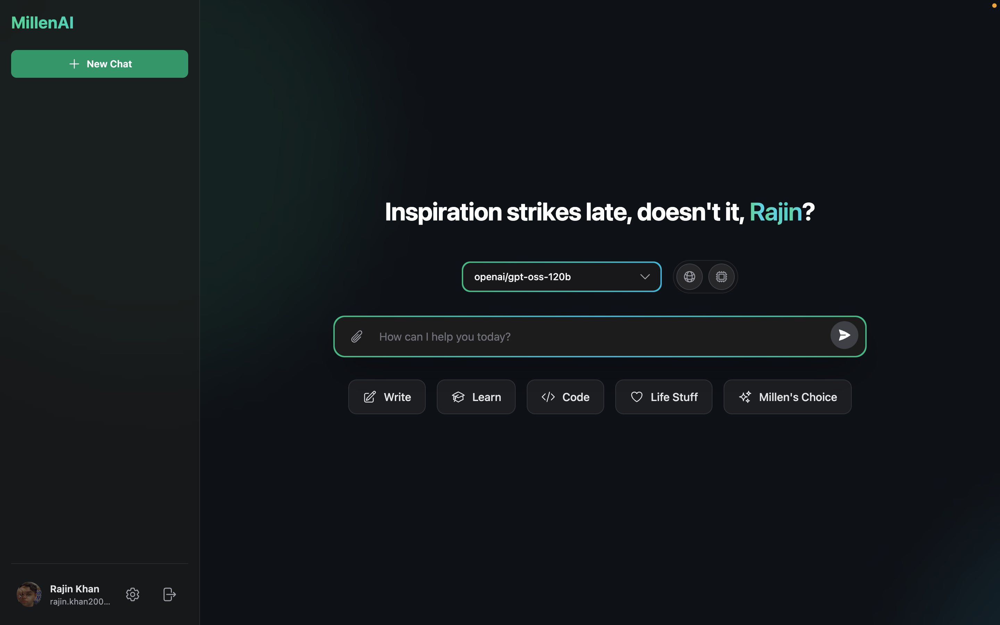

---

<h1>MillenAI</h1>

<em>"A thousand minds, one conversation"</em>

  <a href="#features">Features</a> •
  <a href="#technology-stack">Tech Stack</a> •
  <a href="#roadmap">Roadmap</a>

  

  
  
  
  

---

**MillenAI** is a sleek, high-performance, open-source chat interface designed for seamless interaction with multiple Large Language Models. Built with modern web technologies, it prioritizes speed, user experience, and intelligent conversation management. Go beyond simple chat with the **AI Council**, a multi-agent system designed to tackle your most complex questions.

---

## The Problem

The landscape of Large Language Models is rapidly expanding, but interacting with them remains fragmented and frustrating:

- **Fragmented Experiences** — Each model provider has its own interface, forcing users to juggle multiple tabs and learn different UIs.
- **Lost Conversations** — Most playgrounds are stateless, meaning valuable chat history and insights vanish when tabs close.
- **One-Dimensional Answers** — Standard chats provide a single perspective, often lacking the depth required for complex, nuanced problems.
- **Poor User Experience** — Functional but unpolished interfaces that lack speed and intuitive design.

## The Solution

### MillenAI

<table>
<tr>
<td width="50%">

#### 🏛️ **AI Council for Deep Reasoning**
Go beyond single-model responses. Convene a council of specialized AI agents (Researcher, Analyst, Philosopher, Judge) that collaborate in real-time to deliver comprehensive, multi-faceted verdicts on complex topics.

#### 📎 **Advanced Document Processing**
Bring your own data. Upload images (with OCR), PDFs, DOCX, and more. MillenAI processes them client-side and incorporates their content directly into your conversation context.

#### 🧠 **Unified Intelligence** 
Switch between cutting-edge models like Llama 3.1 and GPT-OSS within the same conversation thread, choosing the right tool for the right task.

</td>
<td width="50%">

#### ⚡ **Blazing Performance**
Powered by the Groq API for near-instant inference and built with React + Vite for a fluid, responsive interface with beautiful animations by Framer Motion.

#### 🔒 **Persistent & Private**
Secure Google Authentication with Firebase ensures your conversations are saved, synced, and always accessible. Your API keys are stored only in your browser's local storage.

#### ✨ **Polished Experience**
From the guided onboarding to the real-time token counter and rich Markdown support, every interaction is carefully crafted for a seamless and intuitive user journey.

</td>
</tr>
</table>

---

## Features

---

### Core Capabilities

-   🏛️ **AI Council Mode** — A multi-agent system that uses a Researcher, Analyst, Philosopher, and Judge to provide deep, multi-perspective answers.
-   📎 **File & Document Processing** — Client-side text extraction from images (OCR), PDFs, DOCX, Excel/CSV, and plain text files.
-   🌐 **Universal Web Search** — Enable real-time internet access for any model with a simple toggle to get up-to-date information.
-   🚀 **Multi-Model Support** — Seamlessly switch between Llama 3.1, Llama 3.3, and GPT-OSS models.
-   🔒 **Secure Authentication** — Google Sign-In with Firebase for safe and persistent conversation management.
-   🗂️ **Real-Time Chat History** — Save, search, rename, and delete all your conversations.
-   📊 **Live Token Counter** — A visual progress bar to monitor context window usage in real-time.
-   ✨ **Rich Markdown Support** — Beautiful formatting for tables, lists, and syntax-highlighted code blocks.
-   ⚙️ **Secure Settings** — Local API key storage with comprehensive preference management.
-   👋 **Guided Onboarding** — A friendly, animated setup process for new users.
-   🎬 **Stunning Animations** — A fluid interface powered by Tailwind CSS and Framer Motion, including a mesmerizing real-time Council visualization.

---

### Try It Now

**[🚀 Launch MillenAI](https://millen-ai.vercel.app)**

*Experience the future of AI conversation*

---

## Technology Stack

| Category | Technology | Purpose |
|:---|:---|:---|
| **Frontend** | React 19+ | Modern UI framework with concurrent features |
| **Build Tool** | Vite 7.0+ | Lightning-fast development and building |
| **Styling** | Tailwind CSS v4 | Utility-first CSS with modern features |
| **State Management** | Zustand | Minimalist global state management for complex features |
| **Authentication** | Firebase Auth | Secure Google Sign-In |
| **Database** | Firestore | Real-time conversation storage |
| **Animations** | Framer Motion | Smooth, performant animations |
| **Deployment** | Vercel | Fast, global edge deployment (with Edge Functions) |
| **Language** | JavaScript (ESM) | Modern ES modules |

---

## API Integration

### Currently Supported

**Groq** — Ultra-fast inference with multiple model options:
- `llama-3.1-8b-instant` — Fast general-purpose conversations. *Used by The Analyst.*
- `llama-3.3-70b-versatile` — Advanced reasoning and complex tasks. *Used by The Philosopher.*
- `openai/gpt-oss-120b` — Cutting-edge performance with tool calling. *Used by The Judge.*
- `compound-beta` — Specialized web search and code execution. *Used by The Researcher.*

---

### Coming Soon

**OpenRouter** • **Together AI** • **Anthropic** • **Cohere** • **Local (Ollama)**

---

## Roadmap

---

### Development Phases

#### Phase 1: Foundation ✅
- Core chat interface
- Groq API integration  
- Firebase authentication
- Basic conversation management

#### Phase 2: Enhancement 🚧
- **AI Council Multi-Agent System**
- **Client-Side Document Processing (OCR, PDF, DOCX)**
- Advanced model parameters
- Streaming responses
- Enhanced conversation tools

#### Phase 3: Intelligence 📋
- Usage analytics and insights
- Collaborative features
- Developer tools and API inspector
- Custom model integration

---

## **👥 Development Team:**
Just me, actually.

| Name                      | Institution             | ID | GitHub | Followers |
|---------------------------|-------------------------|--  |--------|------|
| **Rajin Khan**            | North South University | 2212708042 |  |  |

---

## Contributing

Contributions are welcome from the community! Whether you're fixing bugs, adding features, or improving documentation, your help makes MillenAI better for everyone.

---

## License

MillenAI is released under the **MIT License**.

---

